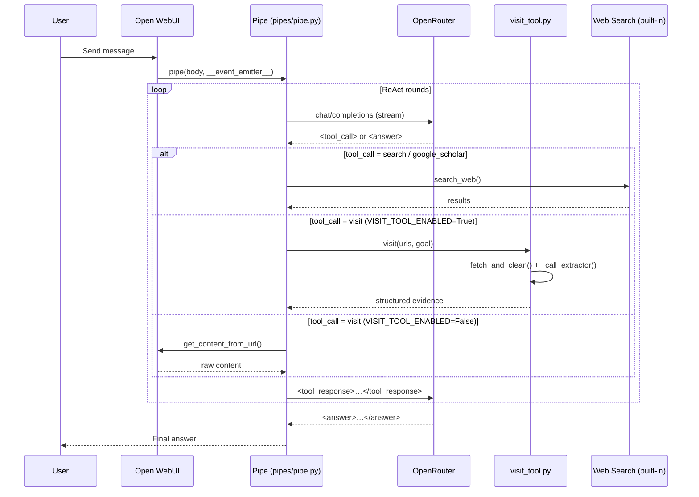

# Tongyi DeepResearch — Open WebUI Pipeline

> Agentic deep-research pipe that bridges Tongyi DeepResearch
> (alibaba/tongyi-deepresearch-30b-a3b via OpenRouter) with Open WebUI.

[](LICENSE)
[](https://www.python.org/)
[](https://openwebui.com/)
[](https://openrouter.ai/)

## Overview

This project bridges Alibaba's Tongyi DeepResearch model into Open WebUI's
agentic pipe system via OpenRouter. The pipe implements a multi-turn ReAct loop
that intercepts the model's XML-structured `<tool_call>` blocks, translates
batched search queries into concurrent web searches using whatever search engine
is configured in Open WebUI, fetches and processes URLs, then feeds the results
back wrapped in `<tool_response>` tags until the model produces a final
`<answer>`.

What makes this pipeline distinct is its two-tier architecture: the outer ReAct
loop manages tool routing and conversation flow, while the standalone
`visit_tool` runs a dedicated LLM-based extraction pipeline driven by
`EXTRACTOR_PROMPT`. Instead of dumping raw page content into context, the visit
tool sends fetched HTML through a separate extractor model that returns
structured JSON with `rational`, `evidence`, and `summary` fields — keeping the
research model's context clean and focused.

## Architecture



## Features

- **Multi-step ReAct loop** with configurable round limit (`MAX_TOOL_ROUNDS`, up to 200)
- **Concurrent search queries** — the model can fire multiple queries in a single `search` call; they execute in parallel via `asyncio.gather`
- **LLM-based structured extraction** via `EXTRACTOR_PROMPT` — the visit tool sends page content through a dedicated extractor model that returns `rational`, `evidence`, and `summary` fields
- **Collapsible tool-call cards** rendered in the chat UI as native `<details>` blocks
- **Cost and token tracking** — running totals displayed in the status bar after each model call
- **Configurable context-length guard** (`MAX_CONTEXT_CHARS`) — forces a final answer before the model's context window is exhausted
- **`VISIT_TOOL_ENABLED` toggle** — switch between the standalone LLM extraction pipeline and the built-in Open WebUI content loader

## Installation

### Prerequisites

- Python ≥ 3.14
- Open WebUI ≥ 0.4.0
- An [OpenRouter](https://openrouter.ai/) API key

### Development

```bash
git clone https://github.com/<org>/tongyi-deepresearch-openwebui-pipeline.git
cd tongyi-deepresearch-openwebui-pipeline
pip install -e ".[dev]"
```

### Production (wheel / git)

Install directly from GitHub:

```bash
pip install git+https://github.com/<org>/tongyi-deepresearch-openwebui-pipeline.git
```

Or download the `.whl` from the
[GitHub Releases](https://github.com/<org>/tongyi-deepresearch-openwebui-pipeline/releases)
page (produced by the CI workflow).

### Releases

Every tagged version (`v*`) triggers the release workflow, which publishes a
GitHub Release containing:

- **Python wheel** (`.whl`) and **sdist** (`.tar.gz`) — install with
  `pip install <file>`.
- **`tongyi_deepresearch_pipe.py`** and **`visit_tool.py`** — the raw shim
  files you can drag-and-drop directly into Open WebUI's Functions / Tools
  panels.

Browse all releases on the
[Releases](https://github.com/<org>/tongyi-deepresearch-openwebui-pipeline/releases)
page.

## Open WebUI Setup

1. Copy `src/tongyi_deepresearch_openwebui_pipeline/pipes/pipe.py` into Open WebUI's **Functions** panel (or mount via the package).
2. Copy `src/tongyi_deepresearch_openwebui_pipeline/tools/visit_tool.py` into Open WebUI's **Tools** panel.
3. Set `OPENROUTER_API_KEY` in the Pipe Valves.
4. Set `SUMMARY_MODEL_API_KEY` in the Visit Tool Valves (can be the same key).
5. Enable a Web Search engine in **Admin → Settings → Web Search**.
6. Start a new chat and select **Tongyi DeepResearch** from the model picker.

## Pipe Valves Reference

| Valve | Type | Default | Description |
|---|---|---|---|
| `OPENROUTER_API_KEY` | `str` | `""` | OpenRouter API key |
| `OPENROUTER_BASE_URL` | `str` | `https://openrouter.ai/api/v1` | API base URL |
| `MODEL_ID` | `str` | `alibaba/tongyi-deepresearch-30b-a3b` | Model on OpenRouter |
| `MAX_TOOL_ROUNDS` | `int` | `30` | Max agentic rounds (1–200) |
| `SEARCH_RESULTS_PER_QUERY` | `int` | `5` | Results per search query (1–20) |
| `MAX_QUERIES_PER_SEARCH` | `int` | `5` | Max queries per `search` call (1–10) |
| `MAX_PAGE_LENGTH` | `int` | `50000` | Max chars kept from a fetched page |
| `VISIT_TOOL_ENABLED` | `bool` | `True` | Use standalone `visit_tool` for LLM extraction; `False` falls back to built-in loader |
| `TEMPERATURE` | `float` | `0.6` | Sampling temperature (0–2) |
| `TOP_P` | `float` | `0.95` | Nucleus sampling (0–1) |
| `PRESENCE_PENALTY` | `float` | `1.1` | Presence penalty (0–2) |
| `MAX_TOKENS` | `int` | `16000` | Max tokens per generation call |
| `MAX_CONTEXT_CHARS` | `int` | `400000` | Context budget before forced wrap-up |
| `SYSTEM_PROMPT_PREAMBLE` | `str` | `""` | Custom instructions prepended to system prompt |
| `EMIT_THINKING` | `bool` | `True` | Show thinking preview in status bar |
| `SHOW_COST_TRACKING` | `bool` | `True` | Show token count and cost in status bar |

## Visit Tool Valves Reference

| Valve | Type | Default | Description |
|---|---|---|---|
| `SUMMARY_MODEL_API_KEY` | `str` | `""` | API key for the extractor LLM |
| `SUMMARY_MODEL_BASE_URL` | `str` | `https://openrouter.ai/api/v1` | OpenAI-compatible base URL |
| `SUMMARY_MODEL_NAME` | `str` | `qwen/qwen3-30b-a3b-instruct-2507` | Extractor model |
| `SUMMARY_TEMPERATURE` | `float` | `0.7` | Extractor temperature (0–2) |
| `MAX_PAGE_TOKENS` | `int` | `120000` | Max chars kept from a fetched page |
| `MAX_RETRIES` | `int` | `3` | LLM retry attempts per URL |
